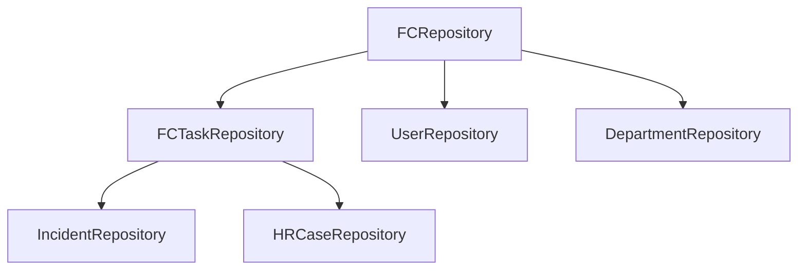

# Overview

The diagram above illustrates the repository pattern implementation in ServiceNow. At the root is the `FCRepository` base class which provides core database interaction functionality. From there, specialized repositories inherit and extend this base functionality:

- `FCTaskRepository` extends `FCRepository` to handle records from the `task` table and its child tables. Since ServiceNow uses table inheritance, any repository that needs to work with a table inheriting from `task` (like `incident` or `sn_hr_core_case`) should extend `FCTaskRepository`. This ensures proper handling of task-specific fields and behaviors.

  - `IncidentRepository` extends `FCTaskRepository` to work specifically with incident records
  - `HRCaseRepository` extends `FCTaskRepository` to work specifically with HR case records

- Other specialized repositories like `UserRepository` and `DepartmentRepository` extend directly from `FCRepository` since they work with independent tables that don't inherit from `task`

!!! note
    Extended repositories can override methods from their parent repository by implementing methods with the same name. For example, `IncidentRepository` could override `getActiveByAssignedToMe()` from `FCTaskRepository` to add incident-specific filtering or behavior.

This pattern provides several benefits:
- Code reuse through inheritance
- Consistent data access patterns
- Separation of concerns between data access and business logic
- Type safety through specialized repositories
- Easier testing and maintenance
