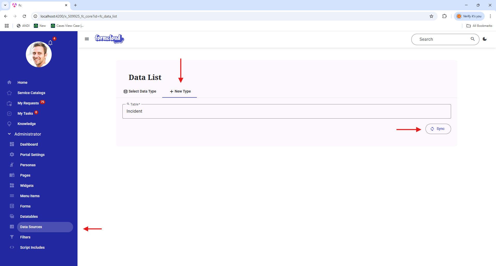
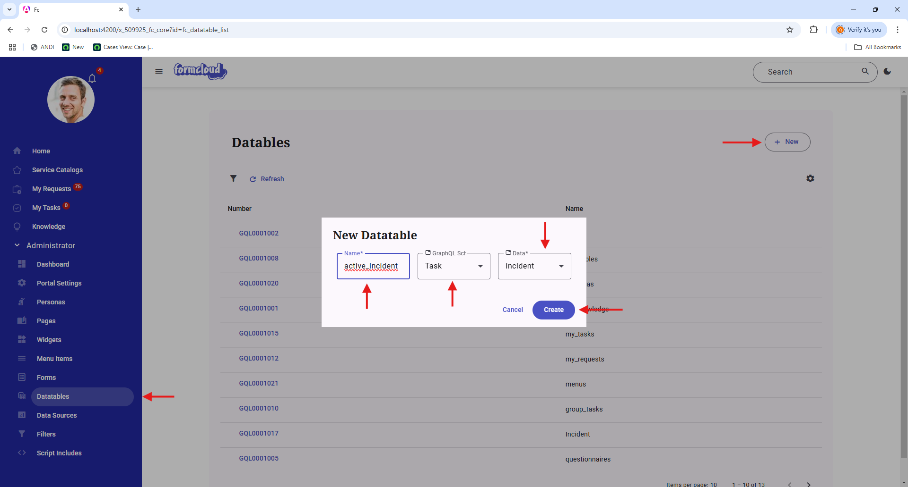
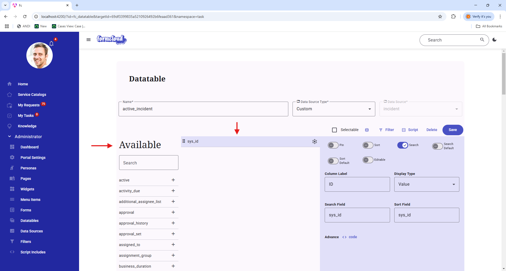
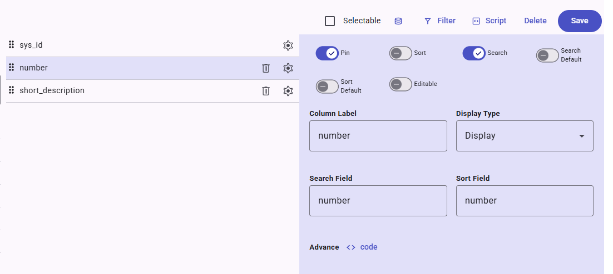
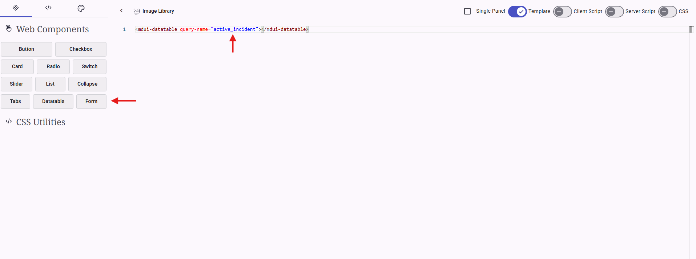

### Step 1: Create a new Data Source 

{ width=50%, align=left}

A prerequisite for creating a datatable is to have a data source for a database table which the datatable will be based on. In this example, we will be using the `incident` table as the data source.

<div style="clear: both;"></div>

### Step 2: Create a new DataTable

{ width=50%, align=left}

Under the Administrator menu item, click on Datatables. Then click on the **"New"** button.

* For the **"Name"** field, enter a unique name for the datatable. In this example, we will be using `active_incident`.
* for the **"GraphQL Shcema"** field, select the `Task` schema as any table that inherits from the `task` table will use this schema.
* for the **"Data Source"** field, select the `incident` data source that we created in the previous step.

<div style="clear: both;"></div>

### Step 3: Configure the DataTable

{ width=50%, align=left}

When we open up the newly created datatable, we will see the following.

* The **"Name"** field is the name of the datatable.
* The **"Data Source Type"** field is the type of the datatable.
* The **"Data Source"** field is the data source that we created in the previous step.

Below that we see:

* A **"Selectable"** checkbox. This option indicate if records can be selected from the datatable.
* A **"Filter"** button. This will open up a filter dialog where we can write (server side) javascript code to return a final encoded query string that will serve as the base filter for the datatable.
    * For this example, we will update the filter to return a encoded query for **all active incidents**.
    ```javascript
    ((current, params) => {

        return 'active=true';

    })(current, params);
    ```
* A **"Script"** button. This will open up a dialog where we can write (clident side) javascript code that can be used in the datatable column's advance configuration.


<div style="clear: both;"></div>

### Step 4: Configure the Column

Underneath the Datatable configuration, we can see the column configurations. This area is divided into three panels.

* The **"First Panel"** This column with the header "Available" contains all the field for the `incident` table.
* The **"Second Panel"** This column contains a list of fields that we can add to the datatable.
    * By default, the `sys_id` field is selected.
* The **"Third Panel"** This column will display the configuration of the selected field from the "Second Column".

Continuing from Step 3, we will add two additional fields, `number` and `short_description` to the datatable. Once added, lets click on the gear icon on the `number` field.

There are a few configuration options that we can set for the `number` field.



* **"Pin"** This determines if the field will be displayed in the datatable. There are certain instance where we want to add a field to the datatable but we don't want it to be displayed, hence we can unpin the field. **For this example, we will be pinning the `number` field.**
* **"Sort"** This is a boolean value that determines if the field can be sorted.
* **"Search"** This is a boolean value that determines if the field can be searched. **For this example, we will be enabling the search for the `number` field.**
* **"Search Default"** This is a boolean value that determines at default state, this field will be selected in the search bar.
* **"Sort Default"** This is a boolean value that will be sorted on when the datatable is loaded.
* **"Editable"** This is a boolean value that determines if the field can be edited directly from the datatablelist view.
* **"Column Label"** This is the label that will be displayed in the datatable.
* **"Display Type"** In ServiceNow, there is a concept of value and display value. This is especially useful when dealing with reference, choice, date, etc. If we want to display the actual database value, we can select "Value" otherwise we can select "Display" for a more user friendly value.
* **"Search Field"** This field most of the time will be left defaulted to the selected field name. However, if we want to search on a different field, we can set it to a different field name.
* **"Sort Field"** This field most of the time will be left defaulted to the selected field name. However, if we want to sort on a different field when this field column is sorted, we can set it to a different field name.
* **"Advance"** This field most of the time will be left defaulted to the selected field name. However, if we want to filter on a different field when this field column is filtered, we can set it to a different field name.

### Step 5: Add a Datatable to a Page

Note that the query-name attribute is the name of the datatable that we created in Step 2.

```html
<mdui-datatable query-name="active_incident"></mdui-datatable>
```


