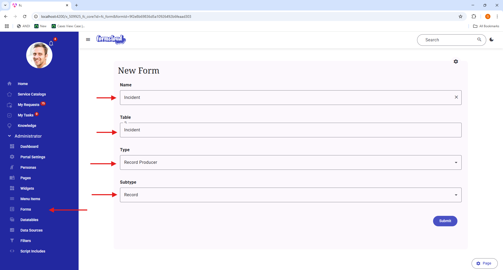
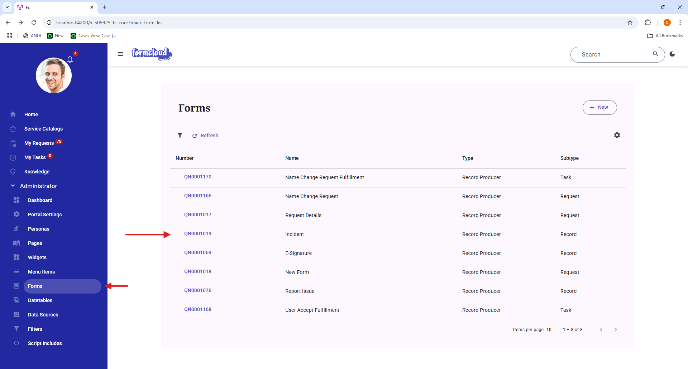
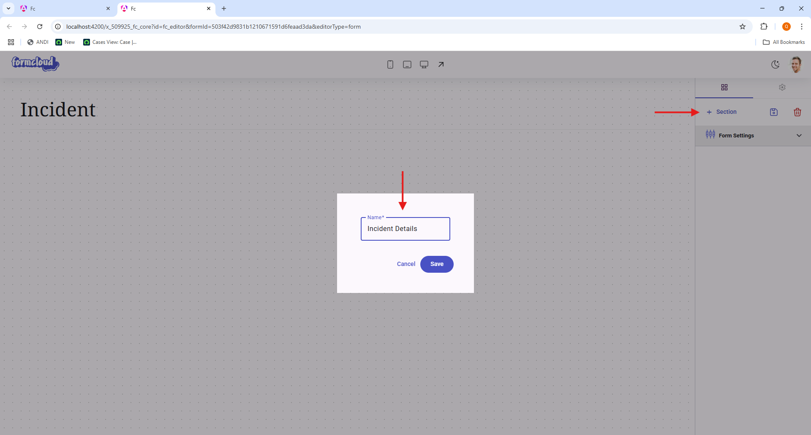
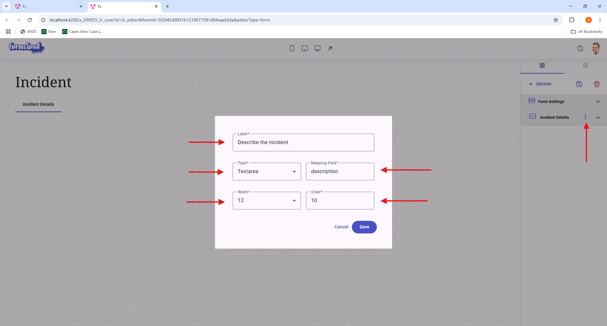
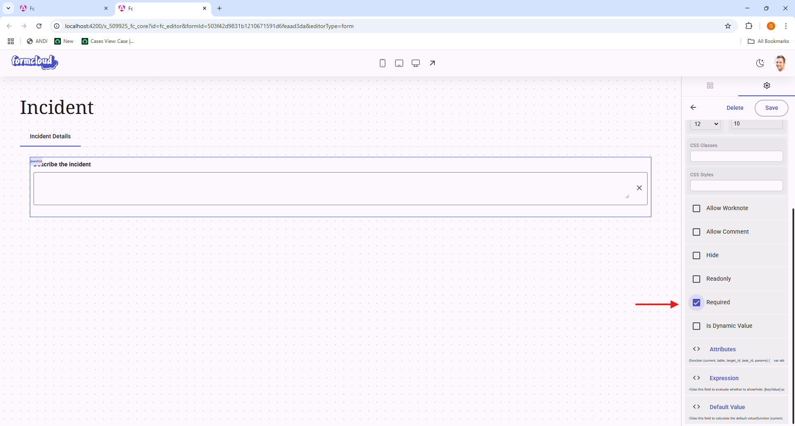
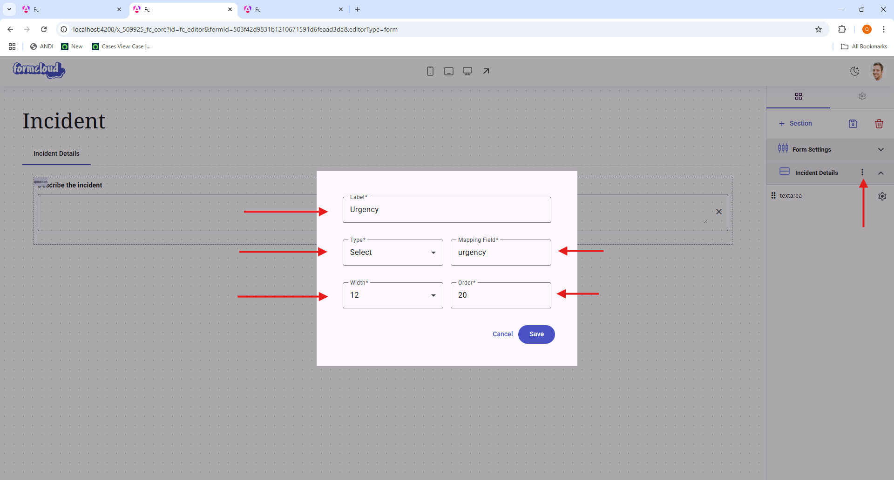

In this example we will create a Record Producer form. When this form is submitted, it will create a new record in the `incident` table. 

### Step 1: Create the form

{ width="50%", align="left" }

* In the **"Administrator"** menu, click **"Form"** menu item.

* Fill in the following fields:
    * **"Name"**: Incident
    * **"Table"**: incident
    * **"Type"**: Record Producer. There are total of 3 types of forms:
        * **Record Producer**: CRUD operations on a record.
        * **JSON Producer**: CRUD operations on a JSON object that is stored in a table field.
        * **JSON Viewer**: Displays a JSON object that is stored in a table field.
    * **"Subtype"**: There are total of 3 subtypes:
        * **Record**: CRUD on a non-task record.
        * **Request**: CRUD on a request record.
        * **Task**: CRUD on a task record.

This form will have two questions:

1. Describe the incident
2. Urgency

Both questions will be added to the **"Incident Details"** section and both questions will be required. However, to create an incident in ServiceNow, we need some additional fields that will be inferred from the user's account to fill out all the other fields.

### Step 2: Create a section

{ width="50%", align="left" }

Once the form is created, look for the newly created form in the list of forms. Click on the form to open it. This will open the Form Builder UI.

{ width="50%", align="left" }

Click on the **"+ Section"** button to add a new section to the form. A dialog will appear to ask for the section name. For this example, we will name the section **"Incident Details"**.

### Step 3: Add the first question

For our first question, we want to ask the user to describe the incident.

{ width="50%", align="left" }

* **"Describe the incident"**: A text field to enter the incident description. We also want to set the following attributes:
    * **"Required"**: True

#### Step 3.1: Configure the first question

{ width="50%", align="left" }

Click on the question on the canvas to open the question properties. Scroll down on the properties panel to find the **"Required"** option and set it to **"True"**.

### Step 4: Add the second question

For the second question, we want to ask the user to select the **"urgency"** of the incident.

{ width="50%", align="left" }

* **"Urgency"**: A dropdown to select the urgency of the incident. We also want to set the following attributes:
    * **"Required"**: True

