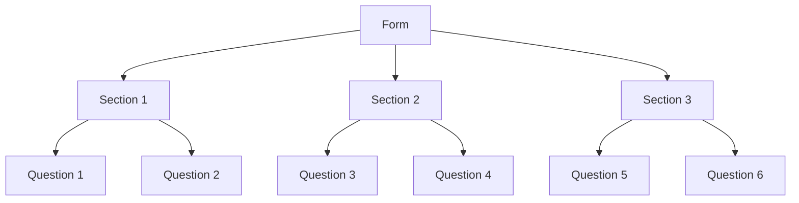

## The Form component is a form builder that allows you to create forms that interact with:

- ServiceNow table record
- Completing a task
- Custom form submission action


The forms are designed as follow:



When the form is displayed, each Section is displayed as a tab. Each question is displayed as a field in the tab. Form, Section and Question are all configurable at their individual level.

### Form Configuration

=== "Attributes"

    During the form load, the `attributes` script is executed to provide metadata about the form. The code below is the default code that is provided when creating a new form.

    There is one method `getDefaultAttributes` that is executed to grab all the default attributes for the form.

    ```javascript linenums="1" hl_lines="3"
    (function(current, table, target_id, task_id, params){
	
        var attributes = new FCQuestionnaireRepository().getDefaultAttributes(current, table, target_id, task_id, params);
        return attributes;
        
    })(current, table, target_id, task_id, params);
    ```

    the `getDefaultAttributes` method returns the following JSON object:

    !!! note
        Keep in mind that all of the attributes should be set via the Form Builder UI. The attributes are  used to provide default values for the form and the ability to override them via code.

    ```json
    {
        "target_id": "sys_id of the target record",
        "name": "Questionnaire Name",
        "css_classes": "bootstrap grid css classes e.g. col-md-6 col-sm-12",
        "show_title": true,
        "data": {},
        "pdf_mappings": {},
        "options": {
            "show_save": true,
            "show_submit": true,
            "submit_label": "Submit",
            "submit_confirmation_message": "Confirmation message",
            "show_cancel": true,
            "deleteable": true,
            "condition": true,
            "condition_failed_message": "You are not authorized to access this resource.",
            "draftable": true,
            "delete_draft_on_load": true,
            "reassignable": true,
            "hide_tab_if_one": true,
            "cancel_label": "Cancel",
            "save_label": "Save",
            "delete_label": "Delete",
            "show_title": true,
            "pdf": "pdf_template_id",
            "require_esignature": false,
            "signature_list": [],
            "close_task_on_submit": false,
            "readonly": false
        }
    }
    ```


=== "Validation Script"

    When the form is submitted, the `validation` script is executed to validate the form. The code below is the default code that is provided when creating a new form. The idea here is flexibility as you can use code to conditionally validate the form.

    The script will return an object with two properties:

    - `validation`: a boolean that indicates if the form is valid
    - `message`: a string that will be displayed to the user if the form is not valid

    ```javascript linenums="1"
    (function(form) {
        var result = {
            validation: true,
            message: ''
        };

        return result;
    })(form);
    ```

    The parameters `form` is the form object that is passed to the script. Here is a sample object below. **The `On After Submit`, `On Cancel` and `On Delete` will also receive the same object.** Lets break down the object:

    !!! note
        The `_` prefix is used to indicate that the property is metadata while the other properties are the form data.
        
    !!! note
        Please keep in mind that the `target_id` will be null when we're not editing an existing record.

    - `_questionnaire_id`: the sys_id of the form
    - `_target_id`: the sys_id of the target record
    - `_task_id`: the sys_id of the task
    - `_table`: the table name of the target record
    - `_params`: the URL query parameters passed to the form
    - `_pdf`: the sys_id of the PDF template
    - `_draftable`: a boolean that indicates if the form is draftable
    - `_require_esignature`: a boolean that indicates if the form requires e-signature
    - `_signature_list`: an array of signatures
    - `first_name`: the first name of the user
    - `last_name`: the last name of the user

    ```json linenums="1" hl_lines="15-16"
    {
        "_questionnaire_id": "492b403b83869210926492b6feaad3f7",
        "_target_id": null,
        "_task_id": null,
        "_table": "sys_user",
        "_params": {
            "id": "request",
            "catItemId": "1d2bc43b83869210926492b6feaad3d9",
            "formId": "492b403b83869210926492b6feaad3f7"
        },
        "_pdf": null,
        "_draftable": false,
        "_require_esignature": false,
        "_signature_list": [],
        "first_name": "Quang",
        "last_name": "Nguyen"
    }
    ```

=== "Submit Callback"

    Once the form is validated and submitted, the `submit_callback` script is executed. This script is used to perform any additional actions after the form is submitted.

    !!! note
        When creating a new record, the `_target_id` will be set to the sys_id of the new record. When editing an existing record, the `_target_id` will be set to the sys_id of the existing record.

    ```javascript linenums="1"
    (function(form) {

    })(form);
    ```

    Please see the [`Validation Script`](#__tabbed_1_2) tab for more information on the `form` parameter.

=== "Cancel Callback"

    When the form is cancelled, the `cancel_callback` script is executed. This script is used to perform any additional actions after the form is cancelled. The code below is the default code that is provided when creating a new form. Not that in the default code, it is by default check to see if this form is associated with a task. If it is, it will cancel the task automatically. If you don't want this behavior, you can override it.

    ```javascript linenums="1"
    (function(form) {
        //First we want to check if there's a task_id
        if(!gs.nil(form._task_id)){
            var calceledTaskResult = new HRTaskRepository().cancelTask(form._task_id);
        }
    })(form);
    ```

    Please see the [`Validation Script`](#__tabbed_1_2) tab for more information on the `form` parameter.

=== "Delete Callback"

    When the form is deleted, the `delete_callback` script is executed. This script is used to perform any additional actions after the form is deleted. The code below is the default code that is provided when creating a new form. By default, it will throw an error to indicate that the script is not implemented. You can override it by providing your own implementation. 

    ```javascript linenums="1"
    (function(form){
        throw new Error('Non Implementation Error.');
    })(form);
    ```

    Please see the [`Validation Script`](#__tabbed_1_2) tab for more information on the `form` parameter.


### Question Configuration

#### Question Types

All question types include these common attributes:
```json
{
  "params": {},
  "table": "string",
  "target_id": "string",
  "task_id": "string",
  "active": "boolean",
  "options": {
    "width": "string",
    "label": "string", 
    "placeholder": "string",
    "css_classes": "string",
    "css_styles": "string"
  }
}
```

The `triggered_questions` array present in all question types contains the `number` values of other questions on the form. When the value of any question listed in this array changes, the current question will re-evaluate its attributes and potentially update its behavior, visibility, or available options. This enables dynamic form behavior where questions can react to changes in other questions' values.

##### E-Signature
Electronic signature input field
```json
{
  "triggered_questions": [],
  "pdf": {} // Optional PDF document configuration
}
```

##### Text
Single line text input field
```json
{
  "triggered_questions": []
}
```

##### Currency
Currency input field
```json
{
  "triggered_questions": []
}
```

##### SSN
Social Security Number input field
```json
{
  "triggered_questions": []
}
```

##### Email
Email input field with validation
```json
{
  "triggered_questions": [],
  "regex": "^[a-zA-Z0-9._%+-]+@[a-zA-Z0-9.-]+\\.[a-zA-Z]{2,}$",
  "regex_message": "Invalid Email"
}
```

##### Phone
Phone number input field
```json
{
  "triggered_questions": []
}
```

#####    Textarea
Multi-line text input field
```json
{
  "triggered_questions": [],
  "min_length": 0,
  "max_length": 500
}
```

##### Date
Date input field with format validation
```json
{
  "triggered_questions": [],
  "regex": "^(0[1-9]|1[012])[\\/](0[1-9]|[12][0-9]|3[01])[\\/]\\d{4}$"
}
```

#####    Datepicker
Date picker widget
```json
{
  "triggered_questions": []
}
```

##### Liquid
Liquid template rendering field
```json
{
  "triggered_questions": [],
  "data": {}
}
```

##### Attachment
File attachment field
```json
{
  "triggered_questions": [],
  "table": "string",
  "target_id": "string",
  "show_delete": true
}
```

##### Select
Dropdown select field
```json
{
  "triggered_questions": [],
  "select_options": [],
  "help": ""
}
```

##### Radio
Radio button group
```json
{
  "triggered_questions": [],
  "select_options": [
    {
      "label": "Yes",
      "value": "Yes"
    },
    {
      "label": "No",
      "value": "No"
    }
  ],
  "vertical": true
}
```

##### Autocomplete
Search-based selection field
```json
{
  "triggered_questions": [],
  "search_table": "",
  "search_query": "",
  "display_columns": [],
  "value_column": "sys_id",
  "min_length": 3,
  "help": "",
  "error": null
}
```

##### Multiselect
Multiple selection field
```json
{
  "triggered_questions": [],
  "select_options": [
    {
      "label": "Option 1",
      "value": "Option 1"
    },
    {
      "label": "Option 2",
      "value": "Option 2"
    }
  ],
  "save_type": "reference"
}
```

##### Multiselect List
Advanced multiple selection field with search
```json
{
  "triggered_questions": [],
  "search_table": "",
  "search_query": "",
  "display_columns": [],
  "value_column": "sys_id",
  "min_length": 3,
  "help": "",
  "required_count": 1,
  "select_options": []
}
```

##### Tree
Hierarchical selection field
```json
{
  "triggered_questions": [],
  "select_options": [
    {
      "id": "option_1",
      "title": "Option 1",
      "item_count": 0,
      "children": [],
      "selectable": true
    }
  ],
  "save_type": "reference"
}
```

##### Checkbox
Boolean checkbox field
```json
{
  "triggered_questions": [],
  "select_options": [
    {
      "label": "Yes",
      "value": true
    },
    {
      "label": "No",
      "value": false
    }
  ]
}
```

##### Dynamic Select
Dynamic dropdown selection field
```json
{
  "triggered_questions": [],
  "select_options": []
}
```

##### Dynamic Multiselect
Dynamic multiple selection field
```json
{
  "triggered_questions": [],
  "select_options": []
}
```

##### Worknote
Work notes and comments field
```json
{
  "triggered_questions": [],
  "additional_comments": [],
  "work_notes": [],
  "allow_comment": "boolean",
  "allow_worknote": "boolean"
}
```

##### Widget
Custom widget container
```json
{
  "triggered_questions": [],
  "widget_id": ""
}
```

##### Repeater
Repeatable form section
```json
{
  "triggered_questions": [],
  "columns": [
    {
      "field_label": "Field Label",
      "field_name": "Field Name",
      "field_type": "string",
      "width": "col-md-12",
      "required": true
    }
  ]
}
```

##### Related List
Related records list
```json
{
  "triggered_questions": [],
  "data": [],
  "questionnaire_id": "",
  "page_id": "hr_questionnaire",
  "columns": [
    {
      "label": "",
      "value": ""
    }
  ]
}
```

##### Datatable
Data table display
```json
{
  "triggered_questions": [],
  "data": [],
  "query_name": "",
  "page_size": 10,
  "show_pagination": true,
  "hide_details": true,
  "allow_selection": false,
  "show_search": true,
  "questionnaire_id": ""
}
```