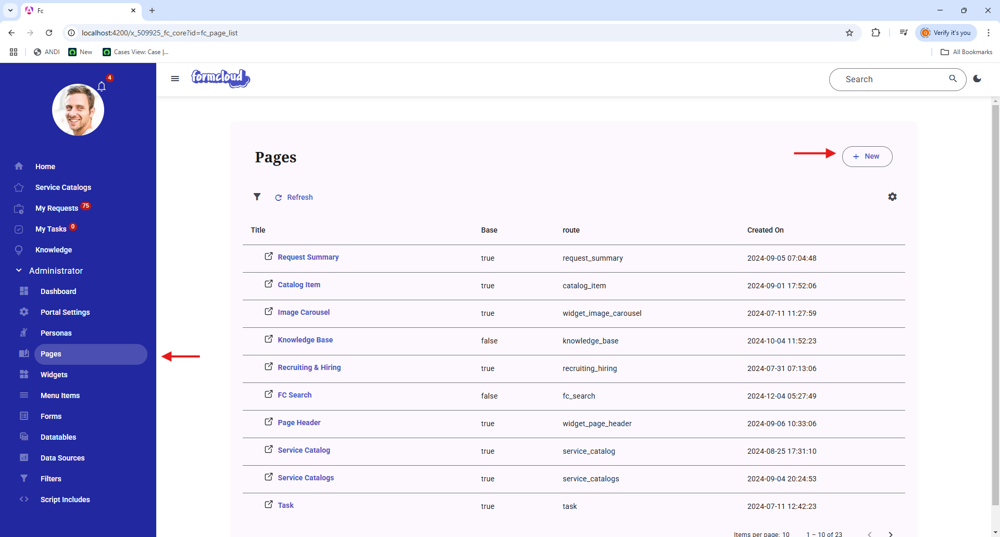
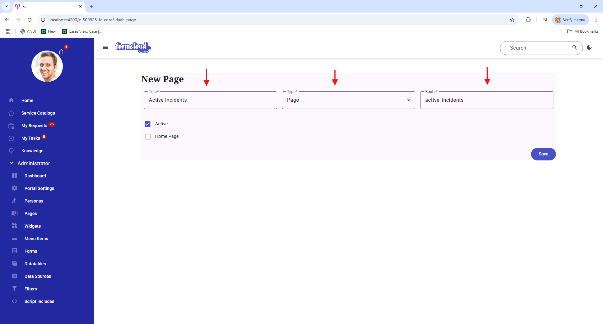
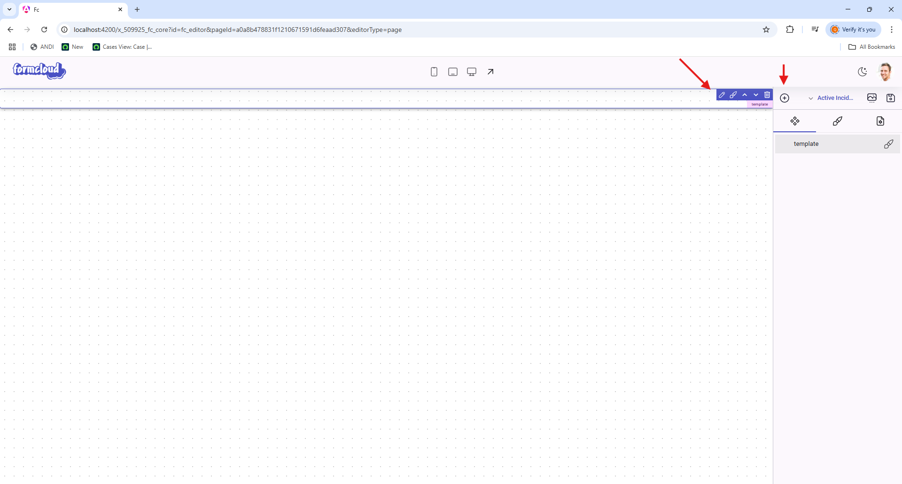

In this example, we will be creating a page that will:

* Fetch a **"single"** record from the `incident` table using the server script.
* Create a function in the server script to update the incident record by closing the incident.
* Display the record in a **"Template"** upon the page is loaded
* Have a button in the template which will trigger a method in the **"Client Script"** that will call the server script method to update the record.

### Step 1: Create a new Page

{ width=50%, align=left}

Create a new page by clicking on the **"New"** button as shown in the image.

<div style="clear: both;"></div>

{ width=50%, align=left}

* For the **"Title"** field, enter a user friendly name for the page.
* For the **"Type"** field, select **"Page"**.
* For the **"Route"** field, enter a unique route for the page. The route is used to access the page and must be unique.
* For the **"Active"** checkbox, select the page to be active.

<div style="clear: both;"></div>

### Step 2: Configure the Page

{ width=50%, align=left}

Click on the plus icon indicated on the image to add a new **Template** component. Once it is added, click the pencil icon indicated on the image to edit the template. Once clicked, the template dialog editor will be opened.

<div style="clear: both;"></div>

=== "Server Script"

    The server script uses the JavaScript revealing module pattern - any functions returned in the object at the bottom will be available for the client to call. In this case, both `initialize()` and `closeIncident()` are exposed.

    ```javascript
    (function (params) {

        function initialize() {
            var model = {
                condition: true
            };

            var incidentGr = new GlideRecord('incident');
            incidentGr.addEncodedQuery('active=true');
            incidentGr.setLimit(1);
            incidentGr.query();
            incidentGr.next();

            model.incident = {
                sys_id: incidentGr.getUniqueValue(),
                number: incidentGr.getValue('number'),
                short_description: incidentGr.getValue('short_description'),
            }

            return model;
        }

        function closeIncident(incidentId){
            var incidentGr = new GlideRecord('incident');
            incidentGr.get(incidentId)

            incidentGr.setValue('state',8);
            incidentGr.update();
        }


        return {
            initialize: initialize,
            closeIncident: closeIncident
        };

    })(params);
    ```

=== "Client Script"

    The `helpers` parameter is an object that contains the following properties:

    * `service`: This is the client side service used to interact with the backend.
        * The service provides the following methods:
            * `call(methodName, parameters, pageId)`: Call a server-side method
            * `search(query)`: Update URL query parameters
            * `navigateToPage(pageId, queryParams)`: Navigate to another page
            * `navigate(url)`: Navigate to a URL
            * `snackbar(message)`: Show a snackbar message
            * `showLoading()`: Show loading indicator
            * `hideLoading()`: Hide loading indicator 
            * `confirm(message)`: Show a confirmation dialog
            * `postAsync(url, payload)`: Make a POST request
            * `getAsync(url)`: Make a GET request
            * `graphQlAsync(query)`: Execute a GraphQL query

    !!! note "Note"
        In this example, we will leverage the `call` method to call the `closeIncident` method in the server script. The `pageId` parameter is the id of the page that is currently loaded. This is an optional parameter and can be omitted if the method does not require it.

    Using the revealing module pattern, only methods returned in the object literal
    will be accessible to the HTML template. In this case, only closeIncident() is exposed.

    ```javascript
    function execute(helpers){
        async function closeIncident(incidentId){
            
            await helpers.service.call('closeIncident', [incidentId]);
            helpers.service.snackbar("Incident closed successfully!");
        
        }

        return {
            closeIncident: closeIncident
        };
    }
    ```

=== "Template"

    ```html
    <div class="container main-container mt-5">
        <div class="row">
            <div class="col p-3">
                <div>
                    <span x-text="$scope.model.incident.number"></span>
                </div>
                <div>
                    <span x-text="$scope.model.incident.short_description"></span>
                </div>
                <div>
                    <mdui-button @click="$scope.closeIncident($scope.model.incident.sys_id)" variant="filled">Close Incident
                    </mdui-button>
                </div>
            </div>
        </div>
    </div>
    ```
