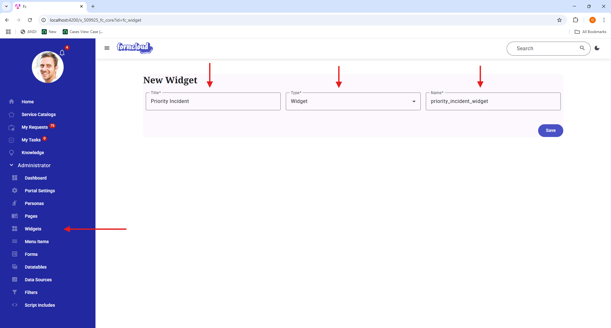

In this example, we will create a simple widget that displays a list of high priority incidents. We will embed this widget into a page that we created in the [Create a new Page](../Page/example.md) section.

### Create a new Widget

{ width="50%" align="left" }

To create a new widget, click the **Widgets** menu item in the left sidebar.

There are three required fields:

1. **Title**: The display name of the widget.
2. **Type**: The type of the widget. For this example, we will select **Widget**.
3. **Name**: The name of the widget. This will be used as the identifier for the widget therefore it must be unique.

<div style="clear: both;"></div>

=== "Server Script"

    ```javascript
    (function (params) {

        function initialize() {
            var model = {
                condition: true,
                priority_incidents: []
            };

            var priorityIncidentsGr = new GlideRecord('incident');
            priorityIncidentsGr.addEncodedQuery('active=true^priority=1');
            priorityIncidentsGr.query();
            while(priorityIncidentsGr.next()){
                model.priority_incidents.push({
                    sys_id: priorityIncidentsGr.getUniqueValue(),
                    number: priorityIncidentsGr.getValue('number'),
                    short_description: priorityIncidentsGr.getValue('short_description')
                });
            }
            return model;
        }


        return {
            initialize: initialize
        };

    })(params);
    ```

=== "Client Script"

    ```javascript
    function execute(helpers){

        return {
        };
    }
    ```

=== "HTML Template"

    ```html
    <div class="d-flex justify-content-center">
        <template x-for="incident in $scope.model.priority_incidents">
            <mdui-card variant="filled" class="m-1 p-3" style="width: 200px;height: 124px">
                <div class="fw-bold">
                    <span x-text="incident.number"></span>
                </div>
                <div>
                    <span x-text="incident.short_description"></span>
                </div>
            </mdui-card>
        </template>
    </div>
    ```

### Embed the Widget into a Page

To embed the widget into a page, we use the following code below. Note the highlighted line which indicates the html tag with the widget id as the attribute.

```html linenums="1" hl_lines="18"
<div class="container main-container mt-5">
	<div class="row">
		<div class="col p-3">
			<div>
				<span x-text="$scope.model.incident.number"></span>
			</div>
			<div>
				<span x-text="$scope.model.incident.short_description"></span>
			</div>
			<div>
				<mdui-button @click="$scope.closeIncident($scope.model.incident.sys_id)" variant="filled">Close Incident
				</mdui-button>
			</div>
		</div>
	</div>
	<div class="row">
		<div class="col">
			<fc-widget widget-id="priority_incident_widget"></fc-widget>
		</div>
	</div>
</div>
```

