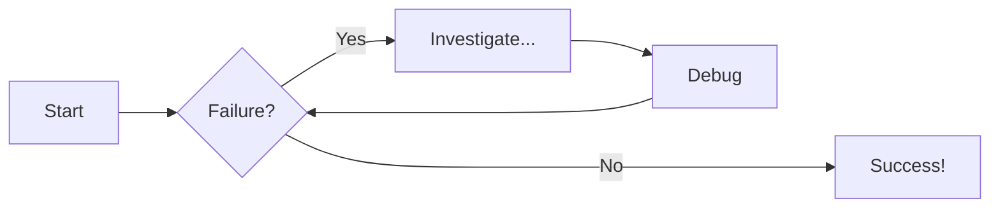

# Function to add two numbers
```js linenums="1" title="page.js"
function test(){
    var a = 123;
    return false;
}
```

=== "HTML"

    Some html here

=== "Client Script"

    Client script here

=== "Server Script"

    Server script


!!! note "Title here"

    Some admonition here...

??? info "Title here"

    Some admonition here...




